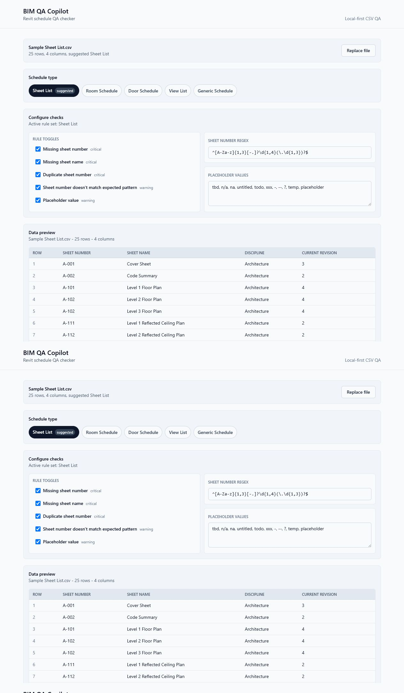

# BIM QA Copilot

BIM QA Copilot is a local-first web app for checking Revit-exported CSV schedules and generating BIM QA issue reports. It runs entirely in the browser: schedules are parsed locally, QA rules run locally, and exported reports are generated locally.

Live demo after GitHub Pages deployment: `https://<github-user-or-org>.github.io/BIM-QA-Copilot/`

Workflow:

1. Upload a Revit CSV, TSV, or TXT schedule export.
2. Preview the parsed rows and parser warnings.
3. Confirm the schedule type.
4. Run BIM QA checks.
5. Filter issues by severity, rule, and search.
6. Export the visible issues as a CSV report.



## Features

- Drag-and-drop CSV upload with file validation.
- Built-in realistic samples for sheet lists, room schedules, door schedules, and view lists.
- Browser-side CSV parsing with quoted fields, BOM stripping, duplicate-header warnings, ragged-row warnings, and TSV auto-detection.
- Schedule type suggestion with user override.
- QA rules for sheet lists, room schedules, door schedules, view lists, and generic schedules.
- Configurable checks with per-rule toggles, custom sheet-number regex, and editable placeholder values saved in localStorage.
- Severity dashboard with filterable, searchable issue table and expandable issue details.
- Excel-friendly CSV issue export with metadata, rule configuration, clean-run PASS reports, UTF-8 BOM, and CRLF line endings.
- Logic tests for parser, rule engine, schedule rules, and CSV export.

## Run

```bash
npm install
npm run dev
npm run test
npm run lint
npm run build
```

Open `http://localhost:3000` after `npm run dev`.

## Deploy

This project is configured for GitHub Pages through `.github/workflows/deploy.yml`.

1. Push the repository to GitHub as `BIM-QA-Copilot`.
2. In GitHub, open `Settings -> Pages`.
3. Set `Build and deployment` to `GitHub Actions`.
4. Push to `main` or run the `Deploy GitHub Pages` workflow manually.

The workflow runs lint, tests, and `next build`, then deploys the static `out/` directory. During GitHub Actions builds, `next.config.ts` automatically sets the Pages base path from the repository name.

## Demo Flow

1. Click one of the sample buttons, such as `Sample Sheet List`.
2. Confirm or change the suggested schedule type.
3. Review the preview table and warnings.
4. Adjust `Configure checks` if the project uses different sheet numbering or placeholder conventions.
5. Click `Run QA checks`.
6. Toggle severity cards, rule pills, or use search to filter the issues.
7. Click `Export report (CSV)` to download the currently visible issue list, including clean PASS reports.

## Rule Reference

| Schedule type | Rule | Severity |
|---|---|---|
| Sheet List | Missing sheet number | Critical |
| Sheet List | Missing sheet name | Critical |
| Sheet List | Duplicate sheet number | Critical |
| Sheet List | Sheet number pattern | Warning |
| Sheet List | Placeholder value | Warning |
| Room Schedule | Missing room number | Critical |
| Room Schedule | Missing room name | Critical |
| Room Schedule | Duplicate room number | Critical |
| Room Schedule | Missing level | Warning |
| Room Schedule | Missing department | Info |
| Room Schedule | Placeholder value | Warning |
| Door Schedule | Missing door number | Critical |
| Door Schedule | Duplicate door number | Critical |
| Door Schedule | Missing associated room | Warning |
| Door Schedule | Missing fire rating | Warning |
| Door Schedule | Placeholder value | Warning |
| View List | Missing view name | Critical |
| View List | Duplicate view name | Critical |
| View List | View missing sheet number | Info |
| View List | Placeholder term in view name | Warning |
| View List | Unclear naming pattern | Info |
| Generic Schedule | Row mostly blank | Warning |
| Generic Schedule | Duplicate value in ID-like column | Warning |
| Generic Schedule | Placeholder value | Warning |
| Generic Schedule | Empty required-looking field | Info |

## Architecture

- `/lib` contains pure parser, detection, rule, sample-data, and export string logic.
- `/lib/config/ruleConfig.ts` owns rule configuration defaults plus SSR-safe localStorage load/save helpers.
- `/types` contains the canonical schedule and issue contracts.
- `app/page.tsx` owns client state and orchestration; components render props and emit callbacks.
- The only DOM-touching utility in `/lib` is `downloadCsv`, separated from the tested `buildIssuesCsv`.

## Scope

Milestone 1 has no accounts, no cloud sync, no database, no AI chatbot, no Autodesk API, and no Revit plugin. Your data never leaves the browser.
